# Protótipo de telas

Protótipo navegável das telas do aplicativo, feito em HTML, CSS e JavaScript
puro. Não usa nenhuma biblioteca externa e funciona sem internet.

Serve como **especificação visual** para a implementação em .NET MAUI: as
medidas, cores, estados e mensagens definidos aqui são a referência para as
páginas em `GestaoFrota.App/Views`.

## Como abrir

Dois cliques em **`prototipo-arquivo-unico.html`**. Abre em qualquer navegador,
sem instalar nada.

Para editar, use `index.html` junto com as pastas `css/` e `js/`.

## O que dá para fazer

- **Navegar** entre as 15 telas pelo menu inferior e pelos botões
- **Trocar de perfil** no seletor "Entrar como", no canto superior direito
- **Ver todas as telas** de uma vez, no botão "Todas as telas"

O seletor de perfil demonstra a navegação contextual: ao escolher
*Operador/Motorista*, os módulos Financeiro, Início e Relatórios desaparecem do
menu e o aplicativo abre direto em Viagens.

## Versões

| Arquivo | O que é |
|---|---|
| `prototipo-arquivo-unico.html` | Alta fidelidade, com cores. **Comece por este.** |
| `wireframe-arquivo-unico.html` | Média fidelidade, escala de cinza |
| `web-arquivo-unico.html` | Estudo de layout para tela grande |
| `web-wireframe-arquivo-unico.html` | O mesmo estudo, em escala de cinza |

As quatro compartilham o mesmo HTML e o mesmo CSS base. As variações são folhas
de estilo empilhadas por cima, geradas por `node gerar-versoes.cjs`.

## Imagens das telas

Em `imagens/` estão as 16 capturas em PNG (389×729), prontas para
documentação e apresentações. A pasta `imagens/wireframe/` traz as mesmas telas
em escala de cinza.

### Autenticação e visão geral

| Login | Indicadores |
|---|---|
| 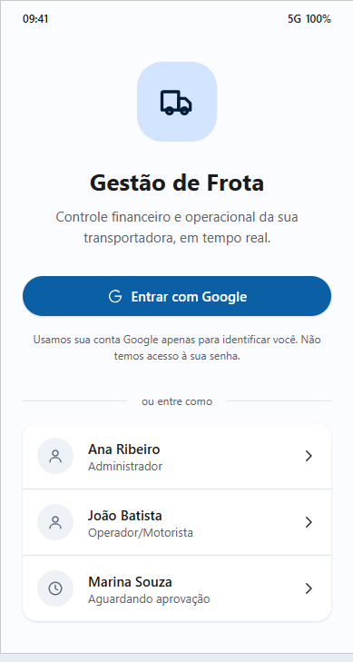 | 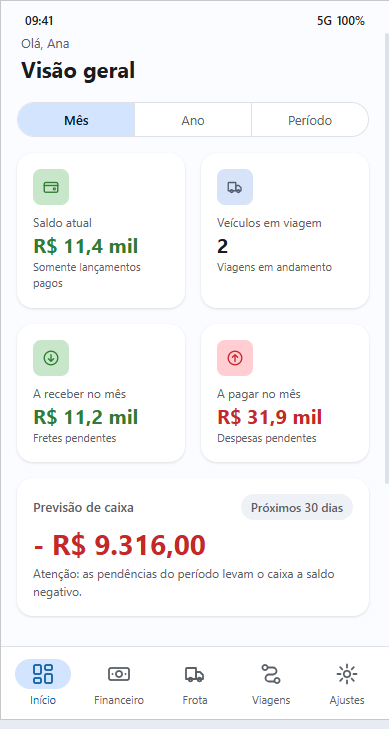 |

### Financeiro

| Movimentações | Categorias | Desativação (soft delete) |
|---|---|---|
| 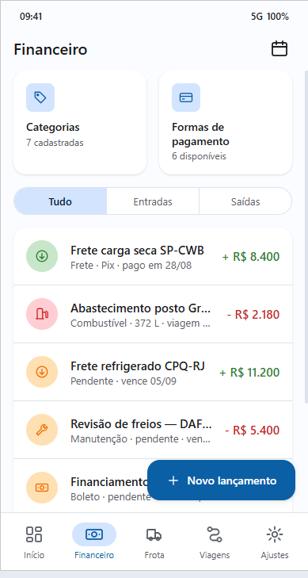 | 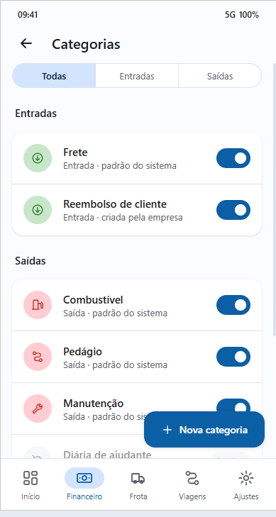 | 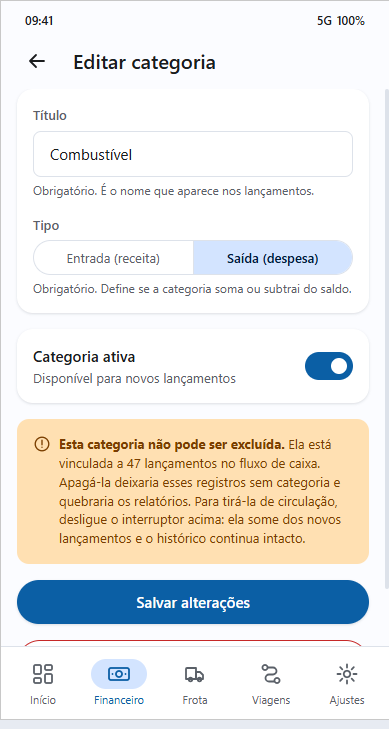 |

| Formas de pagamento | Nova forma | Novo lançamento | Dívidas |
|---|---|---|---|
| 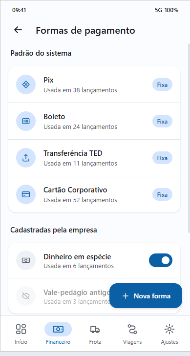 | 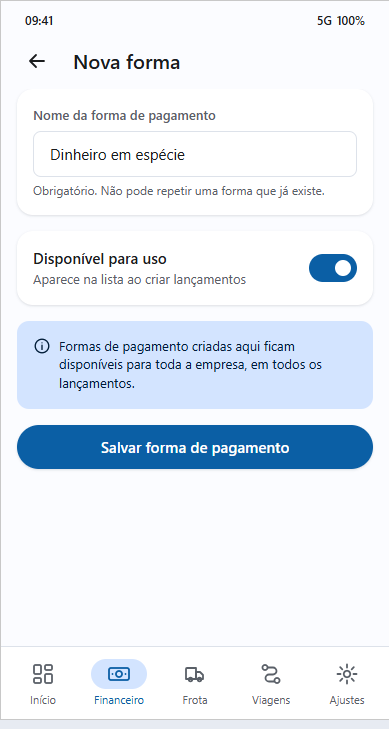 | 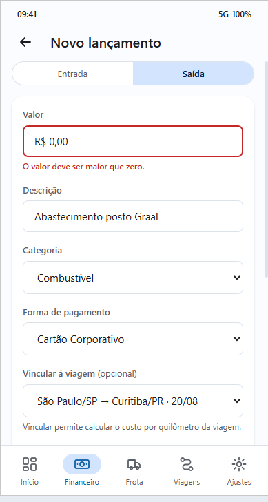 | 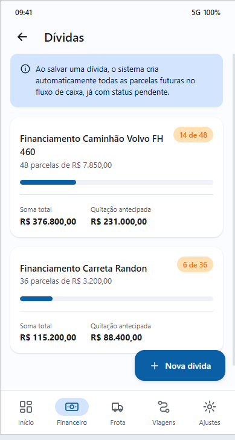 |

### Frota e viagens

| Frota | Viagens | Encerrar viagem |
|---|---|---|
| 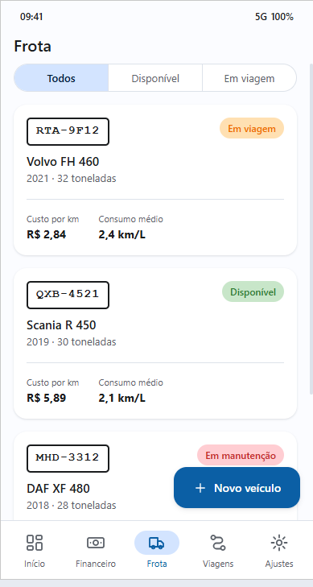 | 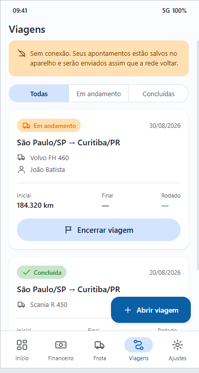 | 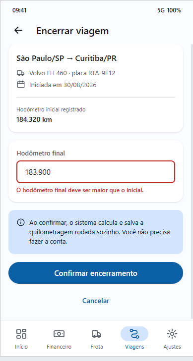 |

### Relatórios e administração

| Relatórios | Usuários | Ajustes |
|---|---|---|
| 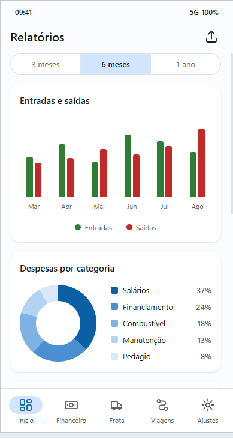 | 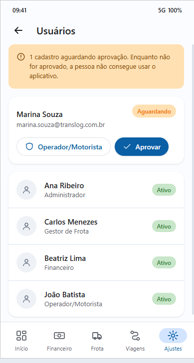 | 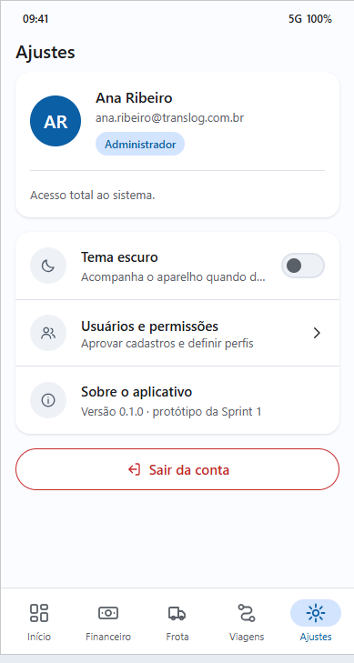 |

### Navegação contextual por perfil

A mesma tela de Viagens, vista por dois perfis diferentes. O menu do
Operador/Motorista não tem Início, Financeiro nem Relatórios — essas telas não
são montadas para ele.

| Administrador | Operador/Motorista |
|---|---|
|  | 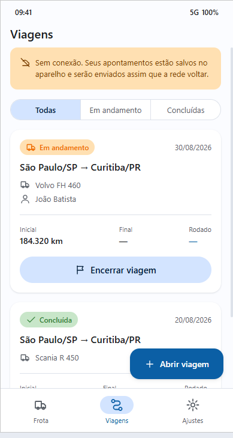 |

## Decisões de design

O requisito não funcional exige um guia de estilos consolidado, para padronizar
botões, margens, tipografia e espaçamentos. Aqui isso virou três regras:

1. **Todas as medidas são múltiplos de 8**, que é a grade do Material Design.
   As variáveis `--espaco-sm` até `--espaco-xl` estão no topo de
   `css/estilo.css`.
2. **Nenhuma tela declara cor solta.** Toda cor vem de uma variável. Mudar
   `--cor-primaria` muda o aplicativo inteiro.
3. **Verde e vermelho são discretos**: colorem o número e um ícone pequeno,
   nunca o fundo do cartão.

Os ícones são desenhos SVG guardados dentro do próprio HTML, e não links para um
serviço externo — o protótipo funciona offline.

## Estados que o protótipo demonstra

Duas telas mostram **erro de validação de propósito**, para servirem de
referência do comportamento esperado:

- **Novo lançamento**: valor em R$ 0,00 recusado
- **Encerrar viagem**: hodômetro final menor que o inicial, bloqueado

E a tela de edição de categoria demonstra o **soft delete**: não existe botão
"Excluir" em lugar nenhum. A ação se chama "Desativar", a tela informa quantos
lançamentos dependem daquela categoria, e a categoria desativada continua na
lista com a etiqueta "Inativa", saindo apenas dos formulários de novo
lançamento.

## Limites

Isto é um desenho navegável, não o aplicativo. Os dados são fixos, os
formulários não gravam e os filtros mudam apenas o botão selecionado. A
implementação real vive em `GestaoFrota.App`.
